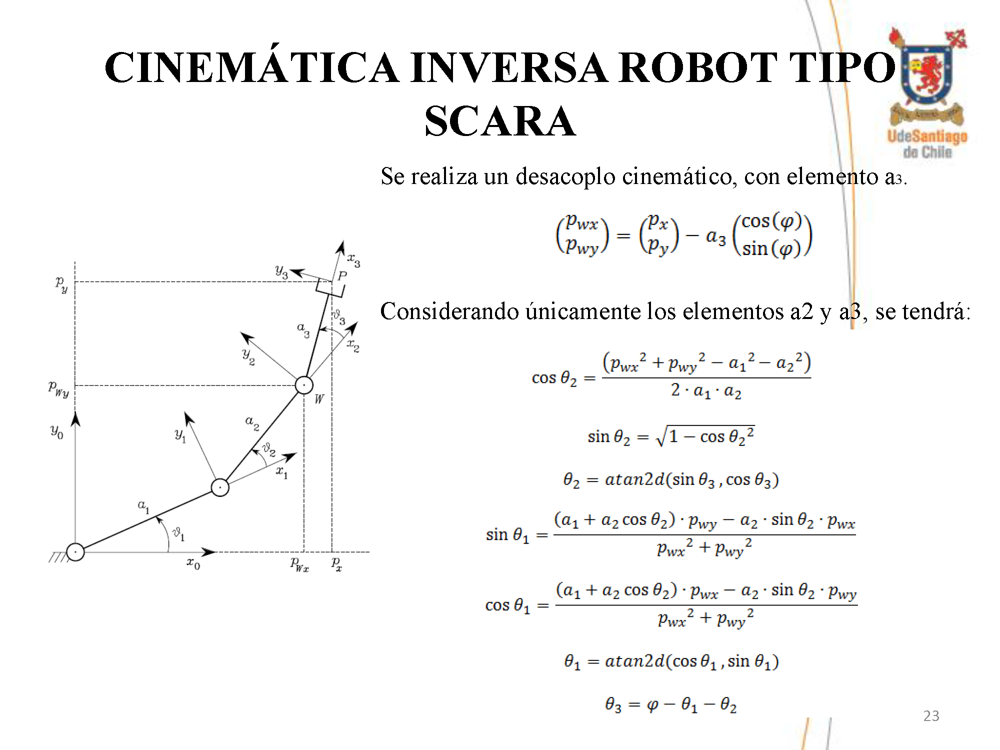

# Desarrollo de Control de Robot Tesis Ingeniero 

Desarrollo de controles para manipulación de robots modelo RV-M1, tipo SCARA y cooperativo entre ellos, para el desarrollo de tesis deIngeniero Civil en Mecánica y Master en Ciencias de la ingeniería, Mención Ingeniería Eléctrica.

## Resultado Final

## Modelo Cinemático Robot Tipo SCARA

## Modelo Cinemático Mitsubishi RV-M1

## Control Lazo Cerrado 

## Modelo con Realidad Virtual VRML

## Interfaz Gráfica Robots Cooperativos
